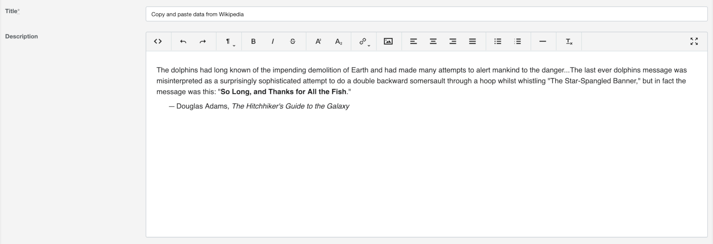

# Active Admin Trumbowyg [](https://badge.fury.io/rb/activeadmin_trumbowyg) [](https://circleci.com/gh/blocknotes/activeadmin_trumbowyg)

An *Active Admin* plugin to use [Trumbowyg](https://alex-d.github.io/Trumbowyg/) as WYSIWYG editor in form inputs.



## Install
- After installing Active Admin, add to your Gemfile: `gem 'activeadmin_trumbowyg'` (and execute *bundle*)
- Add at the end of your Active Admin styles (_app/assets/stylesheets/active_admin.scss_):
```css
@import 'activeadmin/trumbowyg/trumbowyg';
@import 'activeadmin/trumbowyg_input';
```
- Add at the end of your Active Admin javascripts (_app/assets/javascripts/active_admin.js_):
```js
//= require activeadmin/trumbowyg/trumbowyg
//= require activeadmin/trumbowyg_input
```
- Use the input with `as: :trumbowyg` in Active Admin model conf
- To fix icons in production environment execute the task: `rails trumbowyg:nondigest`

> **UPDATE FROM VERSION < 2.0**: please change the Trumbowyg line in your _app/assets/stylesheets/active_admin.scss_ to: `@import 'activeadmin/trumbowyg/trumbowyg';`

## Usage
Form config (example model Article):

```ruby
form do |f|
  f.inputs 'Article' do
    f.input :title
    f.input :description, as: :trumbowyg
    f.input :published
  end
  f.actions
end
```

## Notes
- **data-options** permits to set *trumbowyg editor* options directly; some examples below. For reference see [options list](https://alex-d.github.io/Trumbowyg/documentation/).
-  Why 2 separated scripts/style files? To allow to include different versions of *trumbowyg editor* if needed.
- To use this plugins with *Active Admin 1.x* please use the version [0.1.8](https://github.com/blocknotes/activeadmin_trumbowyg/releases/tag/v0.1.8)

## Examples

### Toolbar buttons configuration

```ruby
f.input :description, as: :trumbowyg, input_html: { data: { options: { btns: [['bold', 'italic'], ['superscript', 'subscript'], ['link'], ['justifyLeft', 'justifyCenter', 'justifyRight', 'justifyFull'], ['unorderedList', 'orderedList'], ['horizontalRule'], ['removeformat']] } } }
```

### Trumbowyg upload plugin
Plugin reference [here](https://alex-d.github.io/Trumbowyg/documentation/plugins/#plugin-upload).

Add to *active_admin.js* (after *trumbowyg* require):

```js
//= require activeadmin/trumbowyg/plugins/upload/trumbowyg.upload
```

Form field config (example model Article):

```ruby
unless resource.new_record?
  f.input :description, as: :trumbowyg, input_html: { data: { options: { btns: [['bold', 'italic'], ['link'], ['upload']], plugins: { upload: { serverPath: upload_admin_post_path(resource.id), fileFieldName: 'file_upload' } } } } }
end
```

Upload method (using ActiveStorage):

```ruby
member_action :upload, method: [:post] do
  result = { success: resource.images.attach(params[:file_upload]) }
  result[:file] = url_for(resource.images.last) if result[:success]
  render json: result
end
```

For the relevant files of this upload example see [here](examples/upload_plugin_using_activestorage/). Consider that this is just a basic example: it shows the editor only for an existing record (because of the *upload_admin_post_path*) and it doesn't provide a way to remove images (just deleting them from the editor will not destroy them, you'll need to implement a purge logic for that).

## Do you like it? Star it!
If you use this component just star it. A developer is more motivated to improve a project when there is some interest.

Take a look at [other Active Admin components](https://github.com/blocknotes?utf8=✓&tab=repositories&q=activeadmin&type=source) that I made if you are curious.

## Contributors
- [Mattia Roccoberton](http://blocknot.es): author
- The good developers that opened issues and pull requests from time to time

## License
The gem is available as open source under the terms of the [MIT](LICENSE.txt).
