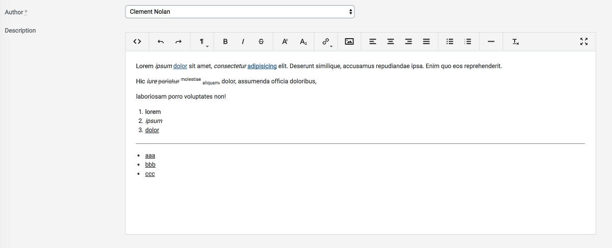

# ActiveAdmin Trumbowyg [](https://badge.fury.io/rb/activeadmin_trumbowyg)

An Active Admin plugin to use [Trumbowyg Editor](https://alex-d.github.io/Trumbowyg/)



## Install

- Update your Gemfile: `gem 'activeadmin_trumbowyg'` (and execute *bundle*)
- Add at the end of your ActiveAdmin styles (_app/assets/stylesheets/active_admin.scss_):
```css
@import 'activeadmin/trumbowyg/ui/sass/trumbowyg';
@import 'activeadmin/trumbowyg_input';
```
- Add at the end of your ActiveAdmin javascripts (_app/assets/javascripts/active_admin.js_):
```js
//= require activeadmin/trumbowyg/trumbowyg
//= require activeadmin/trumbowyg_input
```
- Use the input with `as: :trumbowyg` in Active Admin model conf
- To fix icons in production execute the task: `rake trumbowyg:nondigest` (or `rails trumbowyg:nondigest` for Rails 5.x)

Why 2 separated scripts? In this way you can include a different version of *trumbowyg editor* if you like.

## Options

**data-options**: permits to set *trumbowyg editor* options directly - see [options list](https://alex-d.github.io/Trumbowyg/documentation/)

## Notes

Currently there are minor issues with some Trumbowyg buttons (refer to the project page):
- *deleted text*: can't be unset from toolbar, but it works with Undo
- *superscript*, *subscript*: can't be unset from toolbar (in Chrome), but it works with Undo

## Examples

Form config (example model Article):

```ruby
form do |f|
  f.inputs 'Article' do
    f.input :title
    f.input :description, as: :trumbowyg
    f.input :published
  end
  f.actions
end
```

Toolbar buttons configuration:

```ruby
f.input :description, as: :trumbowyg, input_html: {data: {options: {btns: [['bold', 'italic'], ['superscript', 'subscript'], ['link'], ['justifyLeft', 'justifyCenter', 'justifyRight', 'justifyFull'], ['unorderedList', 'orderedList'], ['horizontalRule'], ['removeformat']]}}}
```

### Example with upload plugin

Add to *active_admin.js* (after *trumbowyg* require):

`//= require activeadmin/trumbowyg/plugins/upload/trumbowyg.upload`

Form field config (example model Article):

```ruby
f.input :description, as: :trumbowyg, input_html: {data: {options: {btns: [['bold', 'italic'], ['link'], ['upload']], plugins: {upload: {serverPath: upload_admin_article_path( resource.id ), fileFieldName: 'file_upload'}}}}}
```

Form method:

```ruby
member_action :upload, method: [:post] do
  response = nil
  resource.cover = params[:file_upload]
  response = resource.save ? {success: '1', file: resource.cover.url} : {success: '0'}
  render json: response
end
```

## Do you like it? Star it!

If you use this component just star it. A developer is more motivated to improve a project when there is some interest.

Take a look at [other ActiveAdmin components](https://github.com/blocknotes?utf8=✓&tab=repositories&q=activeadmin&type=source) that I made if you are curious.

## Contributors

- [Mattia Roccoberton](http://blocknot.es) - creator, maintainer

## License

[MIT](LICENSE.txt)
